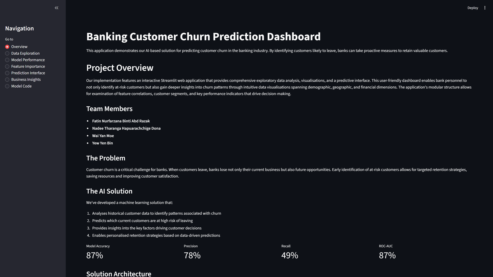
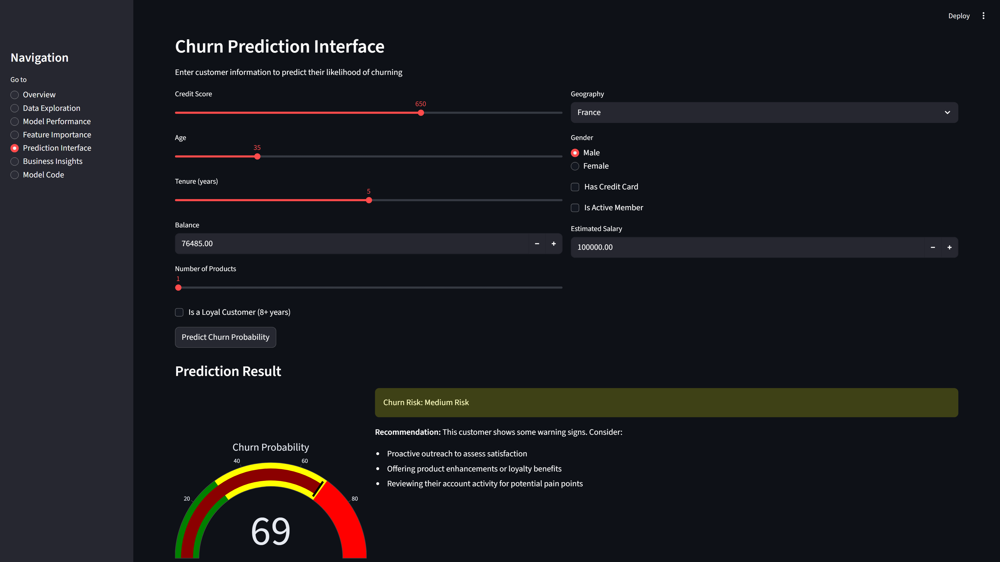
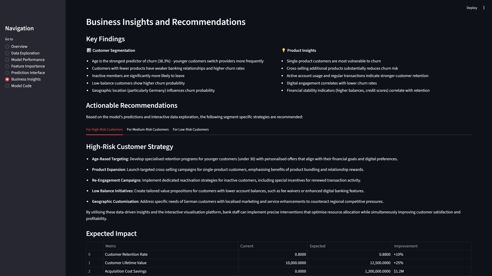
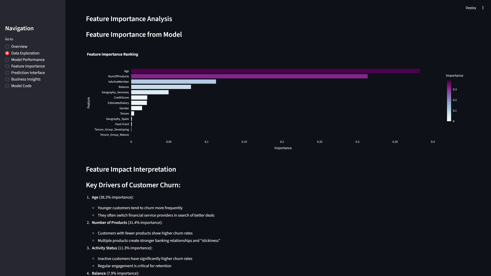
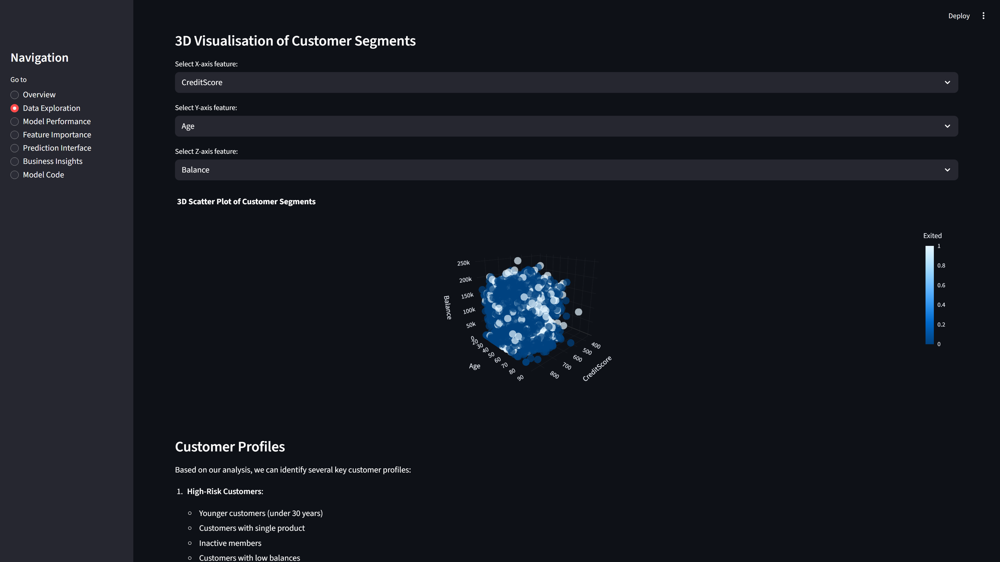

# 💰 Banking Customer Churn Prediction Dashboard

[](https://streamlit.io)


> **"Professional in the dashboard, Gen-Z in the codebase."**
> *A Streamlit web application that predicts customer churn probability and recommends retention strategies based on AI analysis.*

---

## 📸 Project Overview
This dashboard was developed as part of the **Master of Business Analytics (MsBA)** programme. It translates complex machine learning outputs into actionable business insights for banking operations teams.



## ⚡ The Business Problem
Banks lose millions in potential revenue when customers leave (churn). Identifying *who* is about to leave is difficult, but knowing *what to do* to retain them is even harder. 

**This solution addresses the gap by:**
1.  **Predicting** individual churn probability using a Voting Classifier (GBM + Random Forest).
2.  **Prescribing** specific retention strategies segmented by risk level.

---

## 🔮 Key Features

### 1. Interactive Prediction Interface
Users can adjust customer parameters (Credit Score, Age, Balance, etc.) in real-time. The model calculates a "Churn Probability" score and assigns a risk category (Low, Medium, High).



### 2. Strategic Business Insights
Unlike standard dashboards that just show data, this tool provides **prescriptive analytics**. It offers specific retention strategies (e.g., "Re-engagement Campaigns") tailored to the customer's risk profile, along with projected financial impact.



### 3. Advanced Data Exploration
We utilise 3D visualisation and Feature Importance ranking to understand the *root causes* of churn.
* **Feature Importance:** Identifies that `Age` and `Number of Products` are the strongest predictors of churn.
* **3D Segmentation:** Visualises how different customer demographics cluster together.

| Feature Analysis | Customer Segmentation |
| :---: | :---: |
|  |  |

---

## 🛠️ Tech Stack
* **Frontend/UI:** Streamlit (Python)
* **Data Manipulation:** Pandas, NumPy
* **Visualisation:** Plotly Express (Interactive 3D & 2D plots), Seaborn
* **Modelling:** Scikit-Learn (Gradient Boosting, Random Forest, Voting Classifier)

## 💻 How to Run Locally
1.  Clone the repo:
    ```bash
    git clone [https://github.com/waiyanmoe-william/churn-prediction-dashboard.git](https://github.com/waiyanmoe-william/churn-prediction-dashboard.git)
    cd churn-prediction-dashboard
    ```
2.  Install dependencies:
    ```bash
    pip install -r requirements.txt
    ```
3.  Launch the app:
    ```bash
    streamlit run app.py
    ```

## 👥 Credits & Roles
**Team 7 - AI & Decision Making Module**

* **Wai Yan Moe:** Full-stack Streamlit Application, UI/UX Design, Business Logic Implementation.
* **Nadee Tharanga Hapuarachchige Dona:** Machine Learning Model Training & Hyperparameter Tuning.
* **Fatin Nurfarzana Binti Abd Razak:** Data Preprocessing & Research.
* **Yew Yen Bin:** Documentation & Research.